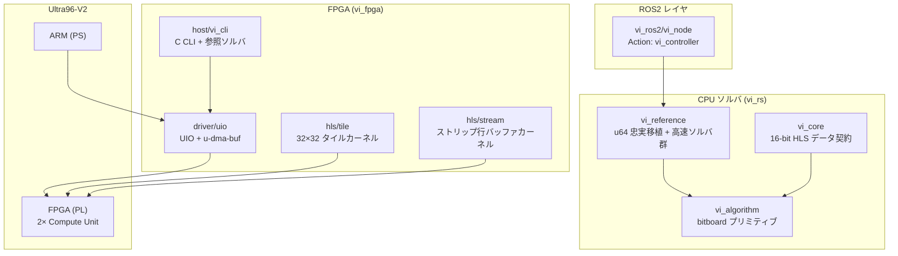

# Value Iteration FPGA / Rust

3次元状態空間 `(x, y, θ)` 上の **Value Iteration（価値反復）** による経路計画を、FPGA ハードウェアアクセラレータ・CPU 高速ソルバ・ROS2 ノードとして実装したモノレポです。

**目標:** Ultra96-V2（Zynq UltraScale+ ZU3EG）上で、キャンパス規模の地図（14,000 × 800 セル、θ=60）を **60 秒以内** に収束させる。

本家は ROS1 パッケージ `value_iteration`（別リポジトリ、`VI_ORIG` でパス指定）であり、本リポジトリはそのアルゴリズムを複数の実装形態で再現・加速・検証します。

---

## 目次

- [アルゴリズム概要](#アルゴリズム概要)
- [リポジトリ構成](#リポジトリ構成)
- [システムアーキテクチャ](#システムアーキテクチャ)
- [データ契約（16-bit HLS 契約）](#データ契約16-bit-hls-契約)
- [サブプロジェクト](#サブプロジェクト)
  - [vi_fpga — FPGA ハードウェア垂直](#vi_fpga--fpga-ハードウェア垂直)
  - [vi_rs — Rust CPU ソルバ](#vi_rs--rust-cpu-ソルバ)
  - [vi_matlab — MATLAB HDL Coder](#vi_matlab--matlab-hdl-coder)
  - [vi_ros2 — ROS2 ノード](#vi_ros2--ros2-ノード)
  - [vi_compare — 本家との比較ベンチ](#vi_compare--本家との比較ベンチ)
- [クイックスタート](#クイックスタート)
- [Makefile ターゲット一覧](#makefile-ターゲット一覧)
- [設計ドキュメント](#設計ドキュメント)
- [開発上の注意](#開発上の注意)

---

## アルゴリズム概要

### Value Iteration とは

離散化された 3D 状態 `s = (ix, iy, it)` に対し、Bellman 方程式を反復的に解きます。

```
V(s) = min_a [ V(s') + penalty(s') ]
```

| 要素 | 説明 |
|------|------|
| `s` | 離散化された位置・姿勢 `(x, y, θ)` |
| `a` | 6 種類の固定アクション（前進・後退・旋回など） |
| `s'` | アクション `a` による決定的遷移先 |
| `penalty(s')` | 障害物・安全距離に基づくコスト |
| 収束条件 | 全状態の最大変化量 `max_delta` が閾値未満 |

### 遷移モデル

確率的遷移は使わず、各 `(action, theta)` に 1 つの遷移先 `(dix, diy, dit)` を持つ決定的モデルです。

- 6 actions × 60 theta = **360 エントリ**（各 3 バイト、計 1,080 バイト）
- ARM 側で事前計算し、カーネル起動前に DMA でロード

### 典型的な 6 アクション

| # | 名前 | 前進 (m) | 回転 (deg) |
|---|------|----------|------------|
| 0 | forward | 0.3 | 0 |
| 1 | backward | -0.2 | 0 |
| 2 | left | 0.0 | 20 |
| 3 | right | 0.0 | -20 |
| 4 | forward-left | 0.3 | 20 |
| 5 | forward-right | 0.3 | -20 |

---

## リポジトリ構成

```
value_iteration_rust/
├── Makefile              # 全サブシステムへの薄いラッパー
├── vi_fpga/              # HLS カーネル・ドライバ・ホスト CLI・Petalinux
├── vi_rs/                # Rust Cargo ワークスペース（CPU ソルバ）
├── vi_matlab/            # MATLAB HDL Coder 版ストリーミングカーネル
├── vi_ros2/              # ROS2 Humble Rust ノード
├── vi_compare/           # 本家 ROS1 との比較ベンチマーク
├── docs/superpowers/     # 設計仕様・実装計画（日本語）
└── scripts/              # ROS2 ビルド・比較スクリプト
```

ルートの `Makefile` は各サブツリーに委譲するだけです。ビルドは **Linux / WSL** 上で行ってください（Windows GnuWin32 の再帰 `make` は失敗します）。

---

## システムアーキテクチャ



### 実装の二系統

| 系統 | 用途 | 値の型 | 主な場所 |
|------|------|--------|----------|
| **16-bit HLS 契約** | FPGA / MATLAB / C 参照 | `ap_uint<16>` | `vi_fpga/`, `vi_matlab/`, `vi_rs/vi_core` |
| **u64 忠実移植** | CPU 高速ソルバ・ROS2・回帰オラクル | `u64`（PROB_BASE=2^18 固定小数） | `vi_rs/vi_reference` |

u64 ソルバは本家 ROS1 `value_iteration` と **bit-exact**（到達可能セルの収束値が一致）であることが parity テストで検証されています。

---

## データ契約（16-bit HLS 契約）

HLS・MATLAB・Rust `vi_core`・C ホストは同一の型定義を共有します。

| データ | 型 | ビット | 備考 |
|--------|-----|--------|------|
| Value / Penalty | `ap_uint<16>` | 16 | 0–65535 |
| 遷移オフセット | `ap_int<8>` × 3 | 24 | dix, diy, dit |
| 最適アクション | `ap_uint<3>` | 3 | 0–5 |

**センチネル値（重要）:**

| 定数 | 値 | 意味 |
|------|-----|------|
| `PENALTY_OBSTACLE` | `0xFFFF` | 通行不可 |
| `PENALTY_GOAL` | `0xFFFE` | ゴールセル。**隣接セルの penalty として読むときは 0 として扱う**（ゴールの value を 0 に固定するため） |

定義元: `vi_fpga/hls/stream/src/vi_stream_types.h`（tile 版は `vi_fpga/hls/tile/src/vi_types.h`）

---

## サブプロジェクト

### vi_fpga — FPGA ハードウェア垂直

Vitis HLS カーネルから Linux ドライバ・ホスト CLI・Petalinux までを含むハードウェア実装です。

```
vi_fpga/
├── hls/
│   ├── tile/       # 32×32 タイル + 6 セルハロー（TILE_W_H=44）
│   └── stream/     # 13 行ラインバッファによるストリップ処理
├── driver/uio/     # UIO + u-dma-buf（mock バックエンド付き）
├── host/           # vi_cli（PGM マップ + YAML → sweep → 検証）
├── tcl/            # Vitis / Vivado TCL スクリプト
├── vivado/         # ブロックデザイン
├── pynq/           # PYNQ オーバーレイ（事前 Linux ドライバ実験用）
└── petalinux/      # Docker ベース EDF / Yocto ビルド
```

#### 2 種類の HLS カーネル

| カーネル | アーキテクチャ | パイプライン |
|----------|---------------|-------------|
| **tile** | 32×32 タイルを BRAM にロード | `load_tiles` → `compute_bellman` → `store_tiles` |
| **stream** | 水平ストリップを行単位でストリーム | `load_store_row` → `stream_strip` → `compute_row` |

いずれも Vivado BD 上で **2 つの Compute Unit** をインスタンス化し、マップを垂直分割して並列スイープします。

#### 4 層の統合

1. **HLS カーネル** — Bellman 更新のハードウェア実装
2. **デバイスドライバ** (`driver/uio/`) — `vi_device_ops_t` vtable（Linux UIO / mock）
3. **ホスト CLI** (`host/`) — マップ読込・ペナルティ計算・遷移テーブル生成・sweep 実行・`--verify` で C 参照ソルバと bit-exact 比較
4. **ボード bring-up** — Vivado ビットストリーム、device-tree オーバーレイ、Petalinux イメージ

---

### vi_rs — Rust CPU ソルバ

5 クレートの Cargo ワークスペースです。

```
vi_rs/
├── vi_core/        # 16-bit HLS データ契約（types, params, transitions, goal）
├── vi_algorithm/   # 値型非依存の bitboard プリミティブ（3D θ-periodic dilation 等）
├── vi_reference/   # 本家 u64 忠実移植 + 10+ 高速ソルバ
├── vi_fixtures/    # 合成 u16 マップ・遷移（u64 移行後は未使用）
└── vi_bench/       # Criterion ベンチ + bench_summary CLI
```

#### u64 高速ソルバ一覧

`vi_reference::solvers::U64Solver` で切り替え可能です。いずれも到達可能セルの収束値は本家と bit-exact です。

| ソルバ名 | 概要 |
|----------|------|
| `reference` | 全セル走査（オラクル） |
| `frontier3d` | 3D bitboard フロンティア |
| `frontier2d` | 2D 投影フロンティア |
| `frontier2d_soa` / `_pad` / `_par` / `_fused` / `_sparse` | 2D フロンティアの最適化バリアント |
| `frontier_stack` | スタックベースフロンティア |
| `block_refine` | ブロック細分化 |
| `pyramid_sweep` | ピラミッド多解像度スイープ |
| `stream_mimic` | HLS ストリーミングカーネルの CPU 模倣 |
| `frontier3d_tau` / `_topk` / `_coarse_theta` | 近似パラメータ付き（no-op 時は bit-exact） |
| `prio_ls` / `prio_lc` | 優先度付きラベル設定 / 修正 |

---

### vi_matlab — MATLAB HDL Coder

MATLAB 上でのアルゴリズム検証・固定小数点解析・HDL 生成・cosimulation を担います。`vi_fpga/hls/stream/` とアルゴリズムをミラーしています。

**必要ツール:** MATLAB R2024b+, HDL Coder, HDL Verifier, Fixed-Point Designer, SoC Blockset

詳細は [`vi_matlab/README.md`](vi_matlab/README.md) を参照。

---

### vi_ros2 — ROS2 ノード

ROS2 Humble 上の Rust ノード（`rclrs` + `colcon`）です。本家 ROS1 `value_iteration` と **インターフェース等価** です。

```
vi_ros2/
├── vi_interfaces/   # action/Vi.action のみ（ament_cmake）
├── vi_node/         # rclrs ノード（bridge, solver_factory, sweep_thread）
└── docker/          # 開発用 Docker イメージ
```

| 方向 | 名前 | 型 |
|------|------|-----|
| Action server | `vi_controller` | `vi_interfaces/action/Vi` |
| Sub | `map` | `nav_msgs/OccupancyGrid` |
| Pub | `value_function`, `policy` | `nav_msgs/OccupancyGrid` |
| Pub | `cmd_vel` | `geometry_msgs/Twist`（online 時） |

`solver` パラメータで `vi_reference` のソルバを切り替えられます。

---

### vi_compare — 本家との比較ベンチ

本家 ROS1 ノードと本リポジトリの実装を同一問題・同一パラメータで突き合わせるハーネス群です。**本家リポジトリは一切改変しません。**

- **house オラクル比較** — bit-exact 検証（`value_*.npy` 突き合わせ）
- **津田沼ベンチ** — 論文構成の並列スイープ再現
- **動画レンダラ** — スイープ過程の可視化

詳細は [`vi_compare/README.md`](vi_compare/README.md) を参照。

---

## クイックスタート

### 前提条件

| 用途 | 必要なもの |
|------|-----------|
| ホスト C テスト | GCC, make（FPGA 不要） |
| Rust テスト | Rust 1.75+ |
| FPGA ビルド | Vitis 2025.2, Vivado 2025.2（`PATH` に設定済み） |
| ROS2 | Docker（`make ros2-docker` でイメージ構築） |
| MATLAB | MATLAB R2024b+ と関連ツールボックス |
| ボードテスト | Ultra96-V2 + SSH（`VI_TARGET_HOST` 設定） |

### ホストソフトウェア（FPGA 不要）

```bash
make test-host          # mock バックエンドで全ユニットテスト
make -C vi_fpga/host cli-mock   # ローカルデバッグ用 CLI
```

### Rust

```bash
make rs-test            # cargo test --workspace
make rs-bench           # Criterion マイクロベンチ
make rs-bench-summary   # 全ソルバ比較表（CSV / Markdown）
```

### FPGA（カーネル選択: `KERNEL=tile` または `KERNEL=stream`）

```bash
make csim KERNEL=stream     # HLS C シミュレーション
make hls KERNEL=tile        # HLS 合成 + IP エクスポート
make bitstream KERNEL=stream  # ビットストリーム生成
make sync-hw-header KERNEL=tile  # レジスタヘッダをドライバに同期
```

### ROS2（Docker 内）

```bash
make ros2-docker
make ros2-build
make ros2-test
```

### 本家との比較

```bash
# 本家リポジトリのパス（読み取り専用マウント）
export VI_ORIG=~/dev/mywork/value_iteration

make compare-build
make compare-ref              # vi_reference 忠実移植
make compare-u64 compare-u64-summary  # 全 u64 ソルバ
make compare-report           # ROS1 vs ROS2 突き合わせ
```

---

## Makefile ターゲット一覧

### ソフトウェア（vi_fpga）

| ターゲット | 説明 |
|-----------|------|
| `make driver` | `libvi_sweep.a` / `.so` ビルド |
| `make host` | `vi_cli` ビルド |
| `make test-host` | mock ユニットテスト一式 |
| `make test-hw` | Ultra96 上の HW 統合テスト（`VI_TARGET_HOST` 必須） |

### FPGA

| ターゲット | 説明 |
|-----------|------|
| `make csim KERNEL=<tile\|stream>` | HLS C シミュレーション |
| `make hls KERNEL=...` | HLS 合成 + IP エクスポート |
| `make bitstream KERNEL=...` | Vivado ビットストリーム |
| `make sync-hw-header KERNEL=...` | レジスタヘッダ同期 |
| `make clean-fpga` | FPGA ビルド成果物削除 |

### Rust

| ターゲット | 説明 |
|-----------|------|
| `make rs-test` | `cargo test --workspace` |
| `make rs-bench` | Criterion ベンチ |
| `make rs-bench-summary` | マクロ比較表生成 |

### MATLAB

| ターゲット | 説明 |
|-----------|------|
| `make matlab-sim` | matlab.unittest スイート |
| `make matlab-hdl` | HDL IP エクスポート |
| `make matlab-cosim` | HDL Verifier cosimulation |
| `make matlab-bitstream` | ビットストリーム生成 |
| `make matlab-bench` | CPU パス比較ベンチ |

### ROS2 / 比較

| ターゲット | 説明 |
|-----------|------|
| `make ros2-docker` / `ros2-build` / `ros2-test` | ROS2 開発・ビルド・テスト |
| `make compare-*` | 本家 ROS1 との比較ベンチ一式 |

### EDF / Petalinux

| ターゲット | 説明 |
|-----------|------|
| `make edf-docker` / `edf-shell` | EDF ビルド環境 |
| `make edf-setup XSA=...` | EDF プロジェクト初期化 |
| `make edf-build MACHINE=...` | Yocto フルビルド |

---

## 設計ドキュメント

アルゴリズム・データ型・メモリレイアウトの非自明な変更を行う前に、以下を参照してください（日本語）。

| ドキュメント | 内容 |
|-------------|------|
| [`docs/superpowers/specs/2026-04-10-value-iteration-fpga-design.md`](docs/superpowers/specs/2026-04-10-value-iteration-fpga-design.md) | FPGA アクセラレータ全体設計 |
| [`docs/superpowers/specs/2026-04-12-line-buffer-streaming-design.md`](docs/superpowers/specs/2026-04-12-line-buffer-streaming-design.md) | ストリーミングカーネル設計 |
| [`docs/superpowers/specs/2026-05-22-vi-rs-algorithm-port-design.md`](docs/superpowers/specs/2026-05-22-vi-rs-algorithm-port-design.md) | Rust アルゴリズム移植 |
| [`docs/superpowers/specs/2026-06-08-vi-reference-faithful-port-design.md`](docs/superpowers/specs/2026-06-08-vi-reference-faithful-port-design.md) | u64 忠実移植 |
| [`docs/superpowers/specs/2026-06-09-vi-u64-fast-solvers-design.md`](docs/superpowers/specs/2026-06-09-vi-u64-fast-solvers-design.md) | u64 高速ソルバ群 |
| [`docs/superpowers/specs/2026-05-29-vi-ros2-design.md`](docs/superpowers/specs/2026-05-29-vi-ros2-design.md) | ROS2 ノード設計 |

実装計画は `docs/superpowers/plans/` にあります。

---

## 開発上の注意

### データ契約の同期

16-bit データ契約を変更する場合、以下を **同時に** 更新してください。

- `vi_fpga/hls/tile/src/vi_types.h`
- `vi_fpga/hls/stream/src/vi_stream_types.h`
- `vi_fpga/host/src/`（penalty, transitions, vi_reference_c）
- `vi_matlab/src/common/vi_params.m`
- `vi_rs/vi_core/src/`

変更後は `make -C vi_fpga/host test-host` と `make rs-test` を実行してください。

### ゴールセル処理

`PENALTY_GOAL`（`0xFFFE`）は隣接セルの penalty として読むとき **必ず 0 として扱う** 必要があります。この規約を簡略化しないでください。

### コーディング規約

- C コード: `-std=c11 -Wall -Wextra -Werror`（警告ゼロ必須）
- コミットメッセージ: `fix(fpga): ...`, `docs: ...` などスコープ付き imperative
- 詳細は [`AGENTS.md`](AGENTS.md) / [`CLAUDE.md`](CLAUDE.md) を参照

### HW テスト

`make test-hw` は SSH 経由で Ultra96 上で `vi_cli --verify` を実行します。ビットストリームのロードと device-tree オーバーレイの適用は事前に行っておく必要があります（スクリプトは FPGA をプログラムしません）。
