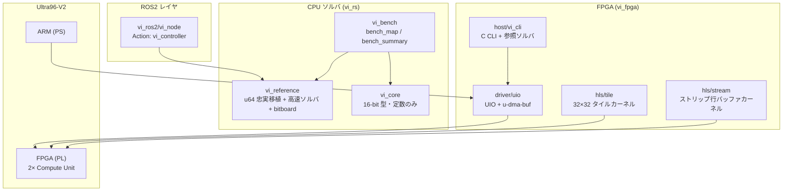

# Value Iteration FPGA / Rust

3次元状態空間 `(x, y, θ)` 上の **Value Iteration（価値反復）** による経路計画を、FPGA ハードウェアアクセラレータ・CPU 高速ソルバ・ROS2 ノードとして実装したモノレポです。

**目標:** Ultra96-V2（Zynq UltraScale+ ZU3EG）上で、キャンパス規模の地図（14,000 × 800 セル、θ=60）を **60 秒以内** に収束させる。

本家は ROS1 パッケージ `value_iteration`（別リポジトリ、`VI_ORIG` でパス指定）であり、本リポジトリはそのアルゴリズムを複数の実装形態で再現・加速・検証します。

**フォーク元:** [NOPLAB/value_iteration3](https://github.com/NOPLAB/value_iteration3)（`upstream` リモート）

```bash
git fetch upstream && git merge upstream/main   # 上流の更新を取り込む
```

---

## 目次

- [アルゴリズム概要](#アルゴリズム概要)
- [リポジトリ構成](#リポジトリ構成)
- [システムアーキテクチャ](#システムアーキテクチャ)
- [データ契約（16-bit HLS 契約）](#データ契約16-bit-hls-契約)
- [サブプロジェクト](#サブプロジェクト)
- [クイックスタート](#クイックスタート)
- [Makefile ターゲット一覧](#makefile-ターゲット一覧)
- [開発上の注意](#開発上の注意)

---

## アルゴリズム概要

### Value Iteration とは

離散化された 3D 状態 `s = (ix, iy, it)` に対し、Bellman 方程式を反復的に解きます。

```
V(s) = min_a [ V(s') + penalty(s') ]
```

| 要素 | 説明 |
|------|------|
| `s` | 離散化された位置・姿勢 `(x, y, θ)` |
| `a` | 6 種類の固定アクション（前進・後退・旋回など） |
| `s'` | アクション `a` による決定的遷移先 |
| `penalty(s')` | 障害物・安全距離に基づくコスト |
| 収束条件 | 全状態の最大変化量 `max_delta` が閾値未満 |

### 遷移モデル

確率的遷移は使わず、各 `(action, theta)` に 1 つの遷移先 `(dix, diy, dit)` を持つ決定的モデルです。

- 6 actions × 60 theta = **360 エントリ**（各 3 バイト、計 1,080 バイト）
- ARM 側で事前計算し、カーネル起動前に DMA でロード

### 典型的な 6 アクション

| # | 名前 | 前進 (m) | 回転 (deg) |
|---|------|----------|------------|
| 0 | forward | 0.3 | 0 |
| 1 | backward | -0.2 | 0 |
| 2 | left | 0.0 | 20 |
| 3 | right | 0.0 | -20 |
| 4 | forward-left | 0.3 | 20 |
| 5 | forward-right | 0.3 | -20 |

---

## リポジトリ構成

```
value_iteration_rust/
├── Makefile              # 全サブシステムへの薄いラッパー
├── scripts/              # ROS2 ビルド・比較・Rust VI 実行スクリプト
├── vi_fpga/              # HLS カーネル・ドライバ・ホスト CLI・Petalinux
├── vi_rs/                # Rust Cargo ワークスペース（CPU ソルバ）
├── vi_matlab/            # MATLAB HDL Coder 版ストリーミングカーネル
├── vi_ros2/              # ROS2 Humble Rust ノード
└── vi_compare/           # 本家 ROS1 との比較ベンチマーク・動画レンダラ
```

ルートの `Makefile` は各サブツリーに委譲するだけです。ビルドは **Linux / WSL** 上で行ってください（Windows GnuWin32 の再帰 `make` は失敗します）。

---

## システムアーキテクチャ



### 実装の二系統

| 系統 | 用途 | 値の型 | 主な場所 |
|------|------|--------|----------|
| **16-bit HLS 契約** | FPGA / MATLAB / C 参照 | `ap_uint<16>` | `vi_fpga/`, `vi_matlab/`, `vi_rs/vi_core` |
| **u64 忠実移植** | CPU 高速ソルバ・ROS2・回帰オラクル | `u64`（PROB_BASE=2^18 固定小数） | `vi_rs/vi_reference` |

u64 ソルバは本家 ROS1 `value_iteration` と **bit-exact**（到達可能セルの収束値が一致）であることが parity テストで検証されています。

---

## データ契約（16-bit HLS 契約）

HLS・MATLAB・Rust `vi_core`・C ホストは同一の型定義を共有します。

| データ | 型 | ビット | 備考 |
|--------|-----|--------|------|
| Value / Penalty | `ap_uint<16>` | 16 | 0–65535 |
| 遷移オフセット | `ap_int<8>` × 3 | 24 | dix, diy, dit |
| 最適アクション | `ap_uint<3>` | 3 | 0–5 |

**センチネル値（重要）:**

| 定数 | 値 | 意味 |
|------|-----|------|
| `PENALTY_OBSTACLE` | `0xFFFF` | 通行不可 |
| `PENALTY_GOAL` | `0xFFFE` | ゴールセル。**隣接セルの penalty として読むときは 0 として扱う**（ゴールの value を 0 に固定するため） |

定義元: `vi_fpga/hls/stream/src/vi_stream_types.h`（tile 版は `vi_fpga/hls/tile/src/vi_types.h`）

---

## サブプロジェクト

### vi_fpga — FPGA ハードウェア垂直

Vitis HLS カーネルから Linux ドライバ・ホスト CLI・Petalinux までを含むハードウェア実装です。

| カーネル | アーキテクチャ | パイプライン |
|----------|---------------|-------------|
| **tile** | 32×32 タイルを BRAM にロード | `load_tiles` → `compute_bellman` → `store_tiles` |
| **stream** | 水平ストリップを行単位でストリーム | `load_store_row` → `stream_strip` → `compute_row` |

いずれも Vivado BD 上で **2 つの Compute Unit** をインスタンス化し、マップを垂直分割して並列スイープします。

---

### vi_rs — Rust CPU ソルバ

3 クレートの Cargo ワークスペースです（旧 `vi_algorithm` / `vi_fixtures` は `vi_reference` へ統合・撤去済み）。

```
vi_rs/
├── vi_core/        # 16-bit HLS 型・定数（types, params）のみ
├── vi_reference/   # 本家 u64 忠実移植 + 高速ソルバ + bitboard プリミティブ
└── vi_bench/       # Criterion ベンチ + bench_map / bench_summary CLI
```

#### u64 高速ソルバ一覧

`vi_reference::solvers::U64Solver` で切り替え可能です。到達可能セルの収束値は本家と bit-exact です（近似ソルバは no-op パラメータ時）。

| ソルバ名 | 概要 |
|----------|------|
| `reference` | 全セル走査（オラクル） |
| `frontier3d` | 3D bitboard フロンティア |
| `frontier2d` | 2D 投影フロンティア |
| `frontier2d_soa` / `_pad` / `_par` / `_fused` / `_sparse` | 2D フロンティアの最適化バリアント（`_par*` は `std::thread` 並列） |
| **`frontier2d_sparse_compact`** | **アウトオブコア版**。巨大マップを O(nx·ny) 級の常駐メモリで bit-exact に解く |
| `frontier_stack` | スタックベースフロンティア |
| `block_refine` | ブロック細分化 |
| `pyramid_sweep` | ピラミッド多解像度スイープ |
| `stream_mimic` | HLS ストリーミングカーネルの CPU 模倣 |
| `frontier3d_tau` / `_topk` / `_coarse_theta` | 近似パラメータ付き |
| `prio_ls` / `prio_lc` | 優先度付きラベル設定 / 修正 |

`frontier2d_sparse_compact` は `bench_map` の `--compact-band`（値バンド幅、0=auto）と `--compact-out-dir`（ディスク mmap 出力）に対応します。環境変数 `VI_THREADS` でスレッド数を上書きできます。

---

### vi_matlab — MATLAB HDL Coder

MATLAB 上でのアルゴリズム検証・固定小数点解析・HDL 生成・cosimulation を担います。詳細は [`vi_matlab/README.md`](vi_matlab/README.md) を参照。

---

### vi_ros2 — ROS2 ノード

ROS2 Humble 上の Rust ノード（`rclrs` + `colcon`）です。本家 ROS1 `value_iteration` と **インターフェース等価** です。

| 方向 | 名前 | 型 |
|------|------|-----|
| Action server | `vi_controller` | `vi_interfaces/action/Vi` |
| Sub | `map` | `nav_msgs/OccupancyGrid` |
| Pub | `value_function`, `policy` | `nav_msgs/OccupancyGrid` |
| Pub | `cmd_vel` | `geometry_msgs/Twist`（online 時） |

---

### vi_compare — 本家との比較ベンチ

本家 ROS1 ノードと本リポジトリの実装を同一問題・同一パラメータで突き合わせるハーネス群です。

| ベンチ | 内容 |
|--------|------|
| **house** | bit-exact オラクル比較（`value_*.npy` 突き合わせ） |
| **tsudanuma** | 論文 (Ueda+ 2023) 構成の並列スイープ再現 |
| **tsukuba** | 226M states 規模の速度比較動画素材（`frontier2d_sparse_compact` 等） |

動画レンダラ: `render_frames_house.py` / `render_frames_tsudanuma.py` / `render_frames_tsukuba.py` / `render_compact.py`

詳細は [`vi_compare/README.md`](vi_compare/README.md) を参照。

---

## クイックスタート

### 前提条件

| 用途 | 必要なもの |
|------|-----------|
| ホスト C テスト | GCC, make（FPGA 不要） |
| Rust テスト | Rust 1.75+ |
| FPGA ビルド | Vitis 2025.2, Vivado 2025.2 |
| ROS2 | Docker（`make ros2-docker`） |
| MATLAB | MATLAB R2024b+ と関連ツールボックス |
| ボードテスト | Ultra96-V2 + SSH（`VI_TARGET_HOST`） |

### Rust 価値反復（最も手軽）

ROS / Docker 不要。`bench_map` をビルドして PGM/YAML マップ上で VI を実行します。

```bash
# 4×4 tiny マップで smoke test（数秒）
./scripts/run_vi_rust.sh

# house マップ（384×384）
./scripts/run_vi_rust.sh --preset house

# ソルバ指定・結果 CSV 出力
./scripts/run_vi_rust.sh --preset house --solver frontier3d --out /tmp/vi.csv

# 巨大マップ向けアウトオブコアソルバ
./scripts/run_vi_rust.sh --map mymap.yaml --solver frontier2d_sparse_compact \
    --compact-band 0 --compact-out-dir /tmp/compact_out

# Makefile 経由
make rs-run
make rs-run ARGS="--preset house --solver frontier3d --no-build"
```

プリセット: `tiny`（`vi_fpga/host/test/data/tiny.yaml`）/ `house`（`vi_compare/.../maps/house.yaml`）

### ホストソフトウェア（FPGA 不要）

```bash
make test-host          # mock バックエンドで全ユニットテスト
make -C vi_fpga/host cli-mock
```

### Rust テスト・ベンチ

```bash
make rs-test            # cargo test --workspace
make rs-bench           # Criterion マイクロベンチ
make rs-bench-summary   # 合成マップ上の全ソルバ比較表
```

### FPGA

```bash
make csim KERNEL=stream
make hls KERNEL=tile
make bitstream KERNEL=stream
make sync-hw-header KERNEL=tile
```

### ROS2（Docker 内）

```bash
make ros2-docker && make ros2-build && make ros2-test
```

### 本家との比較

```bash
export VI_ORIG=~/dev/mywork/value_iteration
make compare-build
make compare-ref
make compare-u64 compare-u64-summary
```

---

## Makefile ターゲット一覧

| カテゴリ | ターゲット | 説明 |
|----------|-----------|------|
| FPGA ホスト | `driver`, `host`, `test-host`, `test-hw` | C ドライバ・CLI・テスト |
| FPGA | `csim`, `hls`, `bitstream`, `sync-hw-header` | `KERNEL=tile\|stream` |
| Rust | `rs-test`, `rs-bench`, `rs-bench-summary`, **`rs-run`** | テスト・ベンチ・VI 実行 |
| MATLAB | `matlab-sim`, `matlab-hdl`, `matlab-bitstream`, … | HDL Coder フロー |
| ROS2 | `ros2-docker`, `ros2-build`, `ros2-test` | Docker 内 colcon |
| 比較 | `compare-*` | 本家 ROS1 との突き合わせ |
| EDF | `edf-docker`, `edf-setup`, `edf-build` | Petalinux イメージ |

---

## 開発上の注意

### データ契約の同期

16-bit データ契約を変更する場合、以下を **同時に** 更新してください。

- `vi_fpga/hls/tile/src/vi_types.h`
- `vi_fpga/hls/stream/src/vi_stream_types.h`
- `vi_fpga/host/src/`（penalty, transitions, vi_reference_c）
- `vi_matlab/src/common/vi_params.m`
- `vi_rs/vi_core/src/`（`types.rs`, `params.rs`）

u64 モデルの対応ロジックは `vi_reference` 側（`value_iterator.rs` 等）にあります。変更後は `make -C vi_fpga/host test-host` と `make rs-test` を実行してください。

### ゴールセル処理

`PENALTY_GOAL`（`0xFFFE`）は隣接セルの penalty として読むとき **必ず 0 として扱う** 必要があります（HLS / C ホスト側）。u64 モデルは `vi_reference` の `set_goal` / `set_state_values` で同等の挙動を実装しています。

### 詳細ドキュメント

リポジトリ内の設計仕様は整理のため削除されています。実装の詳細・ビルド手順は [`CLAUDE.md`](CLAUDE.md) と [`AGENTS.md`](AGENTS.md) を参照してください。

### HW テスト

`make test-hw` は SSH 経由で Ultra96 上で `vi_cli --verify` を実行します。ビットストリームのロードと device-tree オーバーレイの適用は事前に行っておく必要があります。
